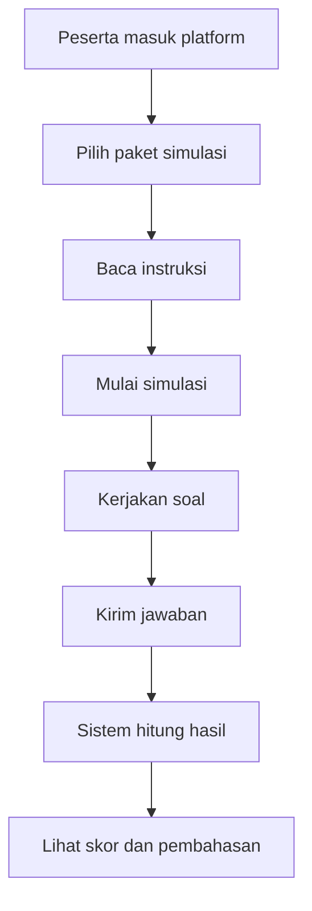
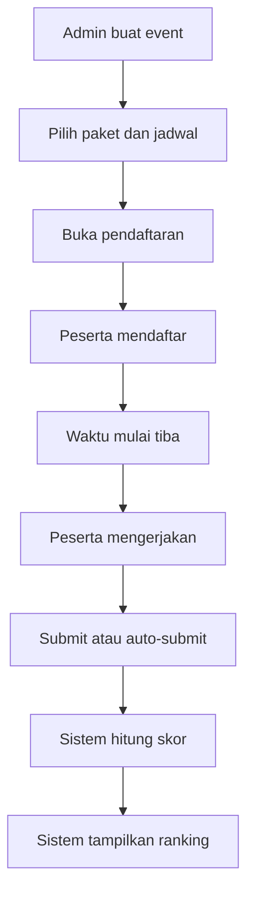
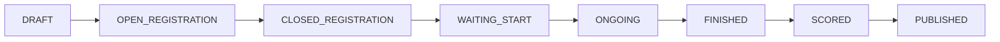

Berikut adalah dokumen ide produk yang disusun untuk diskusi bisnis dan BA.

# Platform Simulasi UTBK Online

## Catatan Dokumen

Dokumen ini ditulis sebagai bahan diskusi tim BA. Fokusnya adalah ide produk, kebutuhan bisnis, alur pengguna, dan hasil yang diharapkan. Dokumen ini tidak memuat spesifikasi API, rekomendasi komponen teknis, atau template PRD.

## 1. Gambaran Produk

Platform Simulasi UTBK Online adalah produk web untuk membantu peserta berlatih menghadapi UTBK melalui simulasi mandiri maupun simulasi serempak dengan jadwal tertentu. Produk ini dirancang agar peserta merasakan alur ujian yang mendekati kondisi asli, sementara admin atau lembaga dapat mengelola event tryout, peserta, hasil, dan peringkat secara terpusat.

## 2. Tujuan Produk

Tujuan utama produk ini adalah:

- Memberikan pengalaman tryout UTBK yang terstruktur dan mudah diikuti.
- Membantu peserta berlatih secara mandiri kapan saja.
- Memungkinkan penyelenggaraan tryout serempak dalam skala besar.
- Menyajikan hasil akhir, pembahasan, dan peringkat secara jelas.
- Menjadi produk yang bisa dijadikan kanal pendapatan bagi lembaga bimbel atau penyedia edukasi.

## 3. Target Pengguna

- Peserta UTBK yang ingin latihan dan ikut tryout.
- Admin platform yang mengelola soal, paket, event, dan hasil.
- Mentor atau tutor yang memantau performa peserta.
- Lembaga bimbel yang ingin menyelenggarakan tryout massal.

## 4. Value Proposition

- Peserta mendapatkan simulasi yang rapi, mudah digunakan, dan terasa seperti ujian sesungguhnya.
- Admin dapat menjalankan event tryout tanpa proses manual yang berulang.
- Mentor dapat melihat hasil belajar dan area yang masih perlu diperkuat.
- Lembaga dapat membuka peluang monetisasi dari event tryout dan akses latihan.

## 5. Ruang Lingkup Produk

Dalam versi awal, ruang lingkup produk mencakup:

- Registrasi dan login pengguna.
- Pengelolaan bank soal.
- Penyusunan paket simulasi.
- Pembuatan event tryout serempak.
- Proses daftar event oleh peserta.
- Pengerjaan ujian dengan batas waktu.
- Penyimpanan jawaban.
- Penilaian hasil.
- Ranking peserta.
- Pembahasan dan ringkasan hasil.

Yang tidak dibahas dalam dokumen ini:

- Rincian API.
- Rincian database level tabel.
- Rekomendasi komponen teknis.
- Template PRD generik.

## 6. Alur Utama Produk

### 6.1 Simulasi Mandiri

Peserta dapat mengerjakan simulasi kapan saja tanpa menunggu jadwal event tertentu.

Alur utamanya adalah:

1. Peserta masuk ke platform.
2. Peserta memilih paket simulasi.
3. Peserta membaca instruksi pengerjaan.
4. Peserta memulai simulasi.
5. Peserta mengerjakan soal sampai selesai.
6. Peserta mengirim jawaban.
7. Sistem menampilkan hasil dan pembahasan.
8. Peserta melihat skor dan area yang perlu diperbaiki.

Hasil yang diharapkan:

- Skor akhir.
- Jumlah jawaban benar, salah, dan kosong.
- Durasi pengerjaan.
- Pembahasan soal.
- Saran materi belajar berikutnya.



### 6.2 Simulasi Serempak

Mode ini digunakan saat penyelenggara ingin semua peserta mengerjakan ujian pada waktu yang sama, misalnya untuk tryout nasional atau event bimbel.

Alur admin:

1. Admin membuat event tryout.
2. Admin memilih paket soal.
3. Admin menentukan waktu mulai dan selesai.
4. Admin menetapkan kuota peserta.
5. Admin membuka pendaftaran.
6. Admin memantau jumlah peserta yang masuk.
7. Saat waktu tiba, event dibuka untuk pengerjaan.
8. Setelah waktu habis, event ditutup.
9. Sistem menghitung hasil dan peringkat.

Alur peserta:

1. Peserta melihat event yang tersedia.
2. Peserta mendaftar ke event.
3. Peserta menunggu waktu mulai.
4. Saat event dibuka, peserta mulai mengerjakan.
5. Peserta menjawab soal dalam durasi yang tersedia.
6. Peserta mengirim jawaban atau sistem menutup otomatis saat waktu habis.
7. Peserta menunggu hasil diproses.
8. Peserta melihat nilai dan peringkat.



### 6.3 Tahapan Event



Makna tiap tahap:

- DRAFT: event masih disiapkan.
- OPEN_REGISTRATION: peserta dapat mendaftar.
- CLOSED_REGISTRATION: pendaftaran sudah ditutup.
- WAITING_START: peserta menunggu waktu mulai.
- ONGOING: ujian sedang berlangsung.
- FINISHED: ujian sudah selesai.
- SCORED: hasil telah dihitung.
- PUBLISHED: hasil dan ranking sudah ditampilkan.

## 7. Kebutuhan Produk

### 7.1 Akses Pengguna

- Pengguna dapat membuat akun.
- Pengguna dapat masuk dan keluar dari platform.
- Sistem dapat membedakan peran peserta, admin, dan mentor.
- Pengguna harus masuk terlebih dahulu sebelum mengikuti simulasi.

### 7.2 Bank Soal

- Admin dapat menambahkan soal baru.
- Admin dapat memperbarui soal.
- Admin dapat menghapus soal.
- Admin dapat menandai jawaban yang benar.
- Admin dapat menambahkan pembahasan.
- Admin dapat mengelompokkan soal berdasarkan kategori.
- Admin dapat menandai tingkat kesulitan soal.

Jenis soal yang ingin didukung pada tahap awal:

- Pilihan ganda.
- Pilihan ganda kompleks.
- Isian singkat.
- Soal berbasis bacaan atau stimulus.
- Soal numerik.

### 7.3 Paket Simulasi

- Admin dapat menyusun paket simulasi dari kumpulan soal.
- Admin dapat menentukan jumlah soal per paket.
- Admin dapat menentukan durasi pengerjaan.
- Admin dapat membedakan paket mandiri dan paket serempak.
- Admin dapat membuat beberapa paket untuk kebutuhan tryout berbeda.

### 7.4 Event Serempak

- Admin dapat membuat event dengan jadwal tertentu.
- Admin dapat menetapkan kuota peserta.
- Admin dapat membuka dan menutup pendaftaran.
- Peserta hanya bisa mengerjakan saat event aktif.
- Sistem menutup akses ketika waktu event selesai.
- Sistem melakukan penutupan otomatis jika peserta belum mengirim jawaban.

### 7.5 Pengalaman Mengerjakan Ujian

- Peserta melihat soal satu per satu atau sesuai format navigasi yang disepakati.
- Peserta dapat menandai soal yang masih ragu.
- Peserta dapat berpindah antar soal dengan mudah.
- Jawaban peserta tersimpan selama proses pengerjaan.
- Timer terlihat jelas selama ujian berlangsung.

### 7.6 Hasil dan Ranking

- Peserta melihat skor akhir setelah ujian selesai.
- Peserta melihat jumlah benar, salah, dan kosong.
- Peserta melihat pembahasan soal.
- Peserta melihat ranking jika event menggunakan sistem peringkat.
- Admin dapat melihat hasil agregat seluruh peserta.

### 7.7 Dashboard Admin dan Mentor

- Admin melihat daftar event aktif dan selesai.
- Admin melihat jumlah pendaftar.
- Admin melihat ringkasan hasil event.
- Mentor melihat performa peserta atau kelompok peserta.
- Mentor melihat area yang paling banyak salah agar bisa memberikan evaluasi.

## 8. Aturan Bisnis Penting

- Peserta hanya bisa mengikuti event jika sudah terdaftar.
- Peserta tidak bisa mulai sebelum waktu event dibuka.
- Peserta tidak bisa mengerjakan setelah waktu habis.
- Jawaban peserta harus tersimpan selama pengerjaan.
- Jika waktu habis, sistem melakukan penutupan otomatis.
- Setelah jawaban dikirim, hasil tidak boleh diubah.
- Ranking hanya dihitung untuk peserta yang benar-benar mengerjakan.
- Peserta yang tidak memulai ujian tidak masuk ranking.
- Pembahasan dapat dibuka setelah ujian selesai atau setelah hasil dipublikasikan.

## 9. Kebutuhan Non-Fungsional

- Platform harus mampu menampung minimal 200 peserta bersamaan.
- Jawaban peserta harus aman dari kehilangan data.
- Timer harus konsisten dan tidak mudah dimanipulasi.
- Platform harus cukup stabil selama event berlangsung.
- Akses peserta hanya boleh ke sesi miliknya sendiri.
- Sistem harus mendukung pemulihan jika koneksi peserta terputus sementara.
- Proses penilaian dan ranking harus tetap konsisten walau peserta banyak.

## 10. Konsep Data Inti

Secara konsep, produk ini akan mengenal beberapa data utama:

- User.
- Soal.
- Paket simulasi.
- Event.
- Pendaftaran event.
- Sesi pengerjaan.
- Jawaban peserta.
- Hasil akhir.
- Ranking.

## 11. Contoh Hasil yang Diharapkan dari Produk

- Peserta dapat daftar event dengan mudah.
- Peserta dapat mengerjakan simulasi tanpa kebingungan.
- Admin dapat menjalankan event tanpa proses manual berulang.
- Hasil ujian dapat keluar dengan cepat setelah event selesai.
- Ranking dapat dipahami oleh peserta dan pihak penyelenggara.
- Produk bisa dipakai sebagai alat belajar sekaligus alat monetisasi.

## 12. Analisa Biaya Investasi Awal

Sesuai permintaan, analisa ini hanya menghitung VPS atau server. Biaya programmer, desain, dan operasional lain tidak dimasukkan.

### Asumsi dasar

- Target awal adalah event dengan sekitar 200 peserta bersamaan.
- Sistem dijalankan dengan 2 server utama agar lebih aman.
- Harga server adalah estimasi pasar umum dan bisa berbeda tergantung provider.

### Skenario server yang disarankan

- 1 VPS aplikasi dengan kapasitas menengah-besar.
- 1 VPS database dengan kapasitas menengah.
- Cadangan kecil untuk backup atau monitoring sederhana.

### Estimasi biaya bulanan

- VPS aplikasi: Rp850.000 per bulan.
- VPS database: Rp450.000 per bulan.
- Backup atau monitoring: Rp150.000 per bulan.
- Total biaya server: Rp1.450.000 per bulan.

### Investasi awal yang perlu disiapkan

Jika dihitung sebagai modal awal untuk satu bulan operasional pertama, maka kebutuhan awal sekitar:

```text
Total modal awal server = Rp1.450.000
```

Jika ingin menyiapkan cadangan 20 persen untuk antisipasi kenaikan beban atau kebutuhan tambahan kecil:

```text
Cadangan 20% = Rp290.000
Total modal awal aman = Rp1.740.000
```

### Catatan kapasitas

- Jika trafik lebih tinggi dari 200 peserta bersamaan, server perlu dinaikkan.
- Jika event hanya berjalan sesekali, biaya bisa ditekan dengan server yang lebih kecil saat idle.
- Jika platform aktif sepanjang bulan, biaya server menjadi biaya tetap bulanan.

## 13. Analisa Profit

### Model pendapatan sederhana

Sumber pendapatan paling mudah untuk produk ini adalah:

- Tiket event tryout per peserta.
- Paket akses latihan premium.
- Bundle tryout dan pembahasan.

### Skenario harga contoh

Jika harga tiket tryout adalah Rp25.000 per peserta dan ada 200 peserta:

```text
Pendapatan = 200 x Rp25.000 = Rp5.000.000
```

Dengan biaya server Rp1.450.000 per bulan, maka estimasi profit kotor dari 1 event adalah:

```text
Profit kotor = Rp5.000.000 - Rp1.450.000 = Rp3.550.000
```

### Skenario lain jika harga tiket Rp20.000

```text
Pendapatan = 200 x Rp20.000 = Rp4.000.000
Profit kotor = Rp4.000.000 - Rp1.450.000 = Rp2.550.000
```

### Break-even point

Break-even dapat dihitung dari jumlah peserta minimum agar biaya server tertutup.

Jika harga tiket Rp25.000:

```text
Break-even = Rp1.450.000 / Rp25.000 = 58 peserta
```

Jika harga tiket Rp20.000:

```text
Break-even = Rp1.450.000 / Rp20.000 = 73 peserta
```

### Interpretasi bisnis

- Dengan 200 peserta, produk ini masih punya ruang profit yang cukup sehat.
- Semakin banyak event dalam satu bulan, biaya server per event akan turun secara efektif.
- Jika produk dipakai oleh lembaga bimbel dengan frekuensi event rutin, margin bisa menjadi sangat menarik.
- Profit paling besar akan terasa jika server dipakai stabil di banyak event, bukan hanya sekali pakai.

### Simulasi profit bulanan

Jika dalam satu bulan ada 4 event, masing-masing 200 peserta, dan harga tiket Rp25.000:

```text
Pendapatan bulanan = 4 x 200 x Rp25.000 = Rp20.000.000
Biaya server bulanan = Rp1.450.000
Profit kotor bulanan = Rp18.550.000
```

## 14. Analisa Keunggulan Dibanding Kompetitor

Kompetitor pada analisa ini dimaksudkan sebagai platform tryout atau belajar online yang umum dipakai di pasar. Perbandingan dibuat untuk melihat posisi produk, bukan untuk menyebut merek tertentu.

### Matriks Perbandingan Berbobot

Skala penilaian menggunakan angka 1 sampai 5, dengan arti:

- 1 = sangat lemah
- 2 = lemah
- 3 = cukup
- 4 = kuat
- 5 = sangat kuat

| Aspek | Bobot | Produk Kita | Skor Produk Kita | Kompetitor Umum | Skor Kompetitor | Catatan |
| --- | ---: | --- | ---: | --- | ---: | --- |
| Fokus produk | 20% | Spesifik untuk simulasi UTBK mandiri dan serempak | 5 | Lebih umum, sering hanya latihan soal atau kelas belajar | 3 | Produk kita lebih tajam ke use case tryout UTBK |
| Simulasi serempak | 20% | Mendukung event dengan banyak peserta pada waktu yang sama | 5 | Tidak semua produk mendukung event massal dengan alur yang rapi | 2 | Ini menjadi diferensiasi utama untuk lembaga |
| Ranking peserta | 15% | Ranking menjadi bagian inti dari hasil event | 5 | Ranking kadang ada, tetapi bukan fokus utama | 3 | Memberi pengalaman kompetitif yang lebih kuat |
| Pembahasan hasil | 15% | Pembahasan menjadi bagian penting setelah ujian selesai | 4 | Pembahasan sering terbatas atau tidak konsisten | 2 | Value belajar pasca tryout lebih terasa |
| Pengalaman peserta | 15% | Alurnya dibuat seperti ujian yang terstruktur | 4 | Pengalaman bisa lebih sederhana atau kurang fokus ke ujian | 3 | Lebih terasa seperti simulasi UTBK sesungguhnya |
| Kendali admin | 10% | Admin dapat mengatur event, kuota, waktu, dan paket soal | 5 | Kontrol event kadang tidak selengkap itu | 3 | Operasional lembaga jadi lebih mudah |
| Potensi monetisasi | 5% | Bisa dijual per event, per paket, atau sebagai langganan | 5 | Monetisasi kadang hanya dari akses umum | 3 | Lebih fleksibel untuk berbagai model pendapatan |
| Diferensiasi bisnis | 10% | Fokus pada pengalaman tryout, hasil, dan skala peserta | 5 | Banyak produk hanya berhenti di latihan soal | 3 | Lebih kuat sebagai produk tryout yang siap dijual |

### Ringkasan Skor

Jika bobot dan skor dijumlahkan secara sederhana, produk kita memperoleh nilai yang lebih tinggi karena unggul di area yang paling penting untuk produk tryout, yaitu simulasi serempak, ranking, dan kontrol event.

| Produk | Nilai Tertimbang |
| --- | ---: |
| Produk Kita | 4.75 |
| Kompetitor Umum | 2.85 |

### Kesimpulan Analisa Kompetitif

Secara posisi pasar, produk ini unggul karena tidak hanya menjadi tempat latihan soal, tetapi juga menjadi platform simulasi yang lengkap untuk event serempak, hasil, dan ranking. Ini membuat produk lebih menarik untuk peserta yang ingin latihan serius dan untuk lembaga yang ingin menjual tryout sebagai produk utama.

## 15. Analisa SWOT

### Strengths

- Fokus produk sangat jelas untuk kebutuhan tryout UTBK.
- Mendukung simulasi mandiri dan serempak.
- Ada nilai bisnis yang kuat dari ranking, pembahasan, dan hasil belajar.
- Cocok untuk lembaga yang ingin mengelola event berskala besar.

### Weaknesses

- Produk cukup bergantung pada jumlah peserta agar profit optimal.
- Butuh pengalaman pengguna yang rapi agar peserta tidak merasa rumit.
- Jika pembahasan kurang kuat, nilai belajar produk bisa turun.
- Keberhasilan produk sangat dipengaruhi kualitas event dan isi soal.

### Opportunities

- Pasar tryout UTBK sangat besar dan terus membutuhkan simulasi berkualitas.
- Lembaga bimbel dapat menjadi channel distribusi utama.
- Produk bisa dikembangkan ke paket premium, langganan, atau event berbayar.
- Ada peluang untuk memperluas ke jenjang atau ujian lain di masa depan.

### Threats

- Banyak platform belajar online yang sudah lebih dulu dikenal pasar.
- Kompetitor bisa meniru fitur dasar dengan cepat.
- Perubahan preferensi peserta bisa menggeser kebutuhan fitur.
- Jika performa event lambat, kepercayaan pengguna bisa turun.

## 16. Positioning Statement

Platform Simulasi UTBK Online diposisikan sebagai produk tryout yang fokus pada pengalaman ujian yang realistis, event serempak berskala besar, dan hasil yang langsung terasa manfaatnya bagi peserta maupun lembaga.

Jika diringkas, positioning produknya adalah:

> Platform tryout UTBK yang membantu peserta berlatih lebih serius dan membantu lembaga menjalankan simulasi massal dengan hasil, ranking, dan pembahasan yang jelas.

## 17. Kesimpulan

Platform Simulasi UTBK Online layak diposisikan sebagai produk belajar dan tryout yang kuat secara bisnis karena punya kebutuhan yang jelas, pasar yang relevan, dan potensi monetisasi yang mudah dipahami.

Fokus paling penting untuk tahap awal adalah:

- peserta bisa daftar event,
- peserta bisa mengerjakan ujian dengan nyaman,
- jawaban tersimpan dengan aman,
- hasil dan ranking keluar dengan cepat,
- biaya server tetap terkendali,
- dan produk punya margin profit yang masuk akal.

Jika diperlukan, dokumen ini bisa dilanjutkan menjadi versi BA yang lebih formal dengan detail user journey, business rule per fitur, dan prioritas MVP.